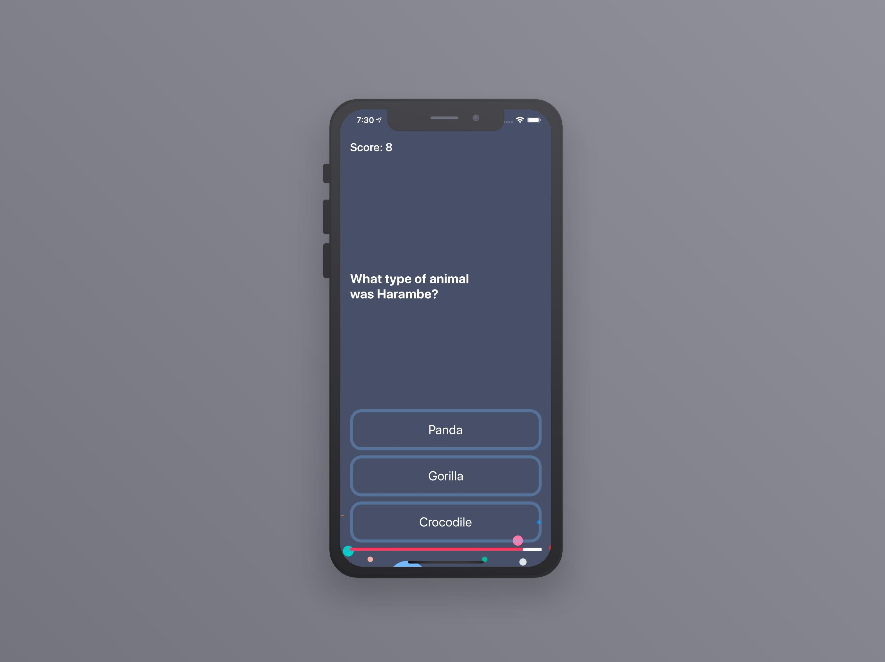

<!-- PROJECT LOGO -->
 

   
  <h2 align="center">Clima</h2>

 A beautiful weather app which allows you to get the live weather data for the current location using the phone's GPS. Plus you'll be able to type in the name of the city that you want to check the weather for. 
  Dark mode enabled.

 

### Technologies Used

`Swift 5`  `OpenWeatherMap API`  `CoreLocation`

### Architecture Used

`MVC`
